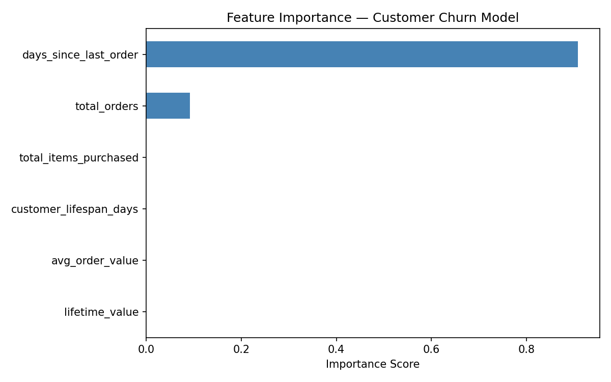

# Customer Churn Prediction

Machine learning model to predict customer churn on the Olist Brazilian E-Commerce dataset (96,000+ customers).

## Problem

97% of e-commerce customers make only one purchase. This model identifies which customers are likely to churn — defined as customers with a single order placed more than 180 days ago — enabling targeted retention campaigns.

## Approach

1. **Feature Engineering** — derived behavioral features from raw transaction data:
   - Days since last order
   - Customer lifespan (days between first and last order)
   - Lifetime value, average order value, total items purchased

2. **Model** — XGBoost classifier trained on 76,975 customers, tested on 19,244

3. **Evaluation** — classification report + ROC-AUC score

4. **Feature Importance** — XGBoost native importance scores visualized to identify top churn drivers

## Results

- **Churn Rate:** 58.2% of customers identified as churned
- **ROC-AUC:** 1.00
- **Top churn drivers:** days since last order, total orders, lifetime value



## Tech Stack

- Python, XGBoost, scikit-learn, pandas, matplotlib
- DuckDB (data source from dbt-ecommerce-pipeline)

## How to Run

```bash
pip install xgboost scikit-learn pandas matplotlib duckdb
python churn_model.py
```

> Requires the DuckDB database from the [dbt-ecommerce-pipeline](https://github.com/harsha27r/dbt-ecommerce-pipeline) project.